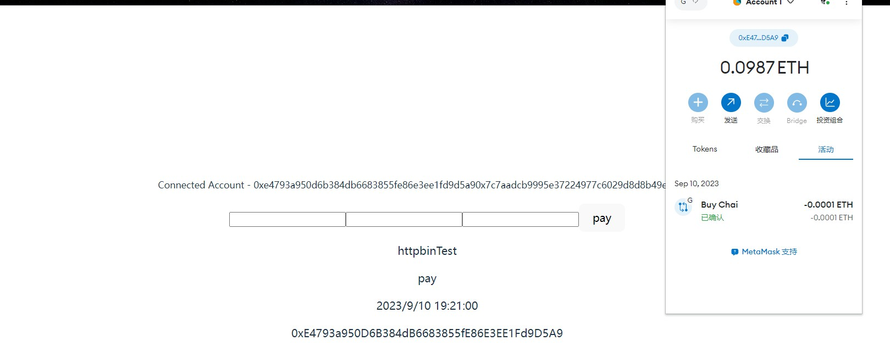

# Sample Hardhat Project

## screenshot of project

## how to run

### deploy contract

- install dependency `npm install`
  
- compile hardhat project `npx hardhat compile`
  
- deploy contract to testnet goerli,get the contract address`npx hardhat run scripts/deploy.js --network goerli`


### run react-app

- `cd client`
- `npm install`
- change the contract address in the `client/app.jsx` at line 16 `const contractAddress =`
- `npm run dev`

### wallet

- install the wallet extension on Chrome
- create a wallet and connect automatically to react-app
- get faucet if you don't have, try e.g., coinbase


### do a transaction

- simply just type in the web page ,name, message, and value of ETH, then click pay
- see a message in console: "transaction successful"


This project demonstrates a basic Hardhat use case. It comes with a sample contract, a test for that contract, and a script that deploys that contract.

Try running some of the following tasks:

```shell
npx hardhat help
npx hardhat test
REPORT_GAS=true npx hardhat test
npx hardhat node
npx hardhat run scripts/deploy.js


```
